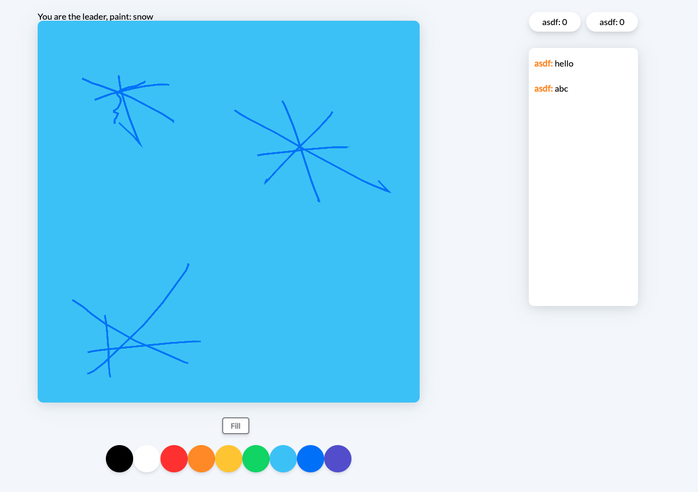

# guess-mine

Realtime Drawing Game built with SocketIO, Gulp and Node

# Description

One person chosen at random draws picture.
And others guess what is that and chat the message.
If the message they chat is the answer, they can get score ( +10 points )

# Drawer

# Others

